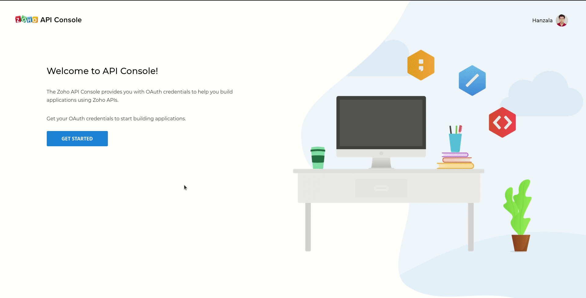
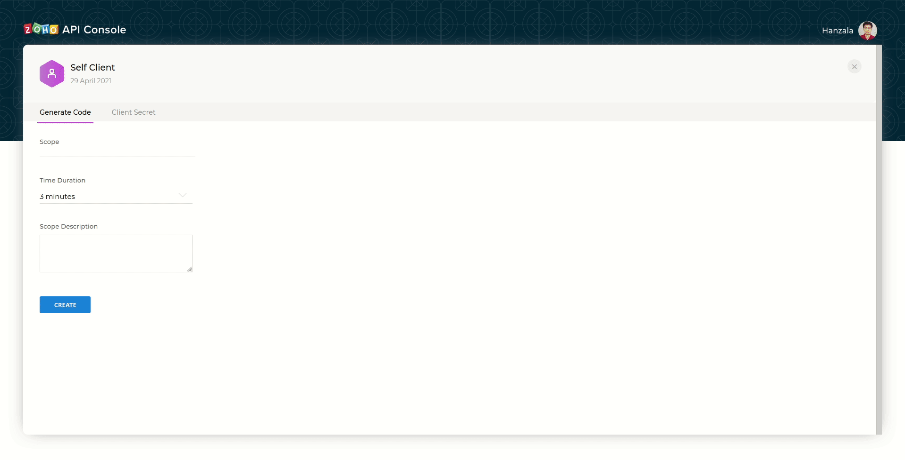

# ear_solutions_bot

WATI Link - https://live-1001.wati.io/


### Save leads in Zoho CRM from WATI
1. Create account in [Zoho CRM](https://www.zoho.com/crm/signup.html?src=login).
2. Go to https://api-console.zoho.in/ and create a __Self Client__ to get a _client ID_ and a _client secret_.
    

3. To generate a grant token, go to __Generate Code__

    - In __Scope__ section, write `AAAServer.profile.read,ZohoCRM.Modules.ALL,ZohoCRM.Bulk.READ,ZohoCRM.org.ALL`.
    - In __Time Duration__ section, select `10 minutes`.
    - In __Scope Description__ section, write anything. It does not matter what you write.
    - Copy the generated grant token and set `grant_token` equal to it in line `19` in [init.py](./init.py)
    - Run [init.py](./init.py) to generate a file named `zcrm_oauthtokens.pkl`.

    

4. Credentials of WATI are stored in [wabot.py](./wabot.py).

5. To test locally, create an Ngrok server at port `5000`.

    - Copy the URL obtained from Ngrok.
    - Create a webhook in WATI [here](https://live-1001.wati.io/webhooks).

6. Run the server
    ```shell
    python app.py
    ```
7. Open [WhatsApp](https://wa.me/917827381478?text=Hi) and start chatting with the bot.

### Sending template messages automatically to newly added leads from Zoho CRM

1. Follow the steps given [here](https://www.wati.io/send-whatsapp-message-from-zoho/).
2. To automate the sending of template messages, go to https://crm.zoho.in/crm/org60008884716/settings/workflow-rules and then create a new workflow rule. Then associate the function created earlier with this workflow rule.
    
